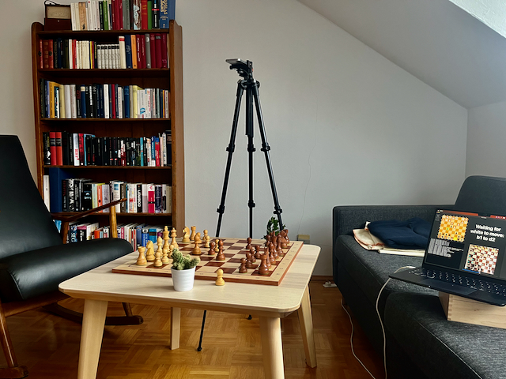
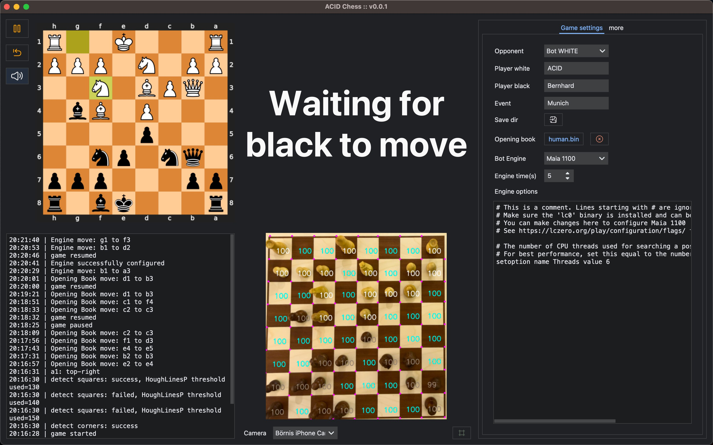

<p align="center">
    
</p>

<p align="center">
    
</p>

&nbsp;

*The Chess Computer for nerds, by nerds.*

[](https://acid-chess.readthedocs.io/)
[](https://discord.com/invite/wdMdBr6jxs)
[](https://github.com/ierror/acid-chess/blob/main/LICENSE)

&nbsp;

## Picture by Picture

ACID Chess is a chess computer written in Python, which can be used with any? board. By filming the board, the
contour of the board is recognized, and the positions of the individual pieces can be determined. 



Two [Neural Networks](https://acid-chess.readthedocs.io/en/latest/dev/neural_networks.html)
were trained for the board and squares recognition.

### Board Segmentation Model


### Square Classification Model

~15585 square images 


# Current Release 

### 2023-03-17: v.0.1.0
- initial release

complete [Changelog](https://acid-chess.readthedocs.io/en/latest/changelog.html)

# Features

You can play against an engine, Stockfish or Maia are available, or play a game against another human. In both variants,
a PGN is generated, which you can load later in the analysis board at Lichess, or so, for analysis.

- Engine play against Stockfish or Maia
- Use polyglot opening books
- PGN exports



# Planned Features

- Clock
- Play on Lichess
- ... see [issues](https://github.com/ierror/acid-chess/issues/) for details

# Technology

- Python as a programming language
- Qt (PySide6) as toolkit for the GUI (with own extension for reactive bindings)
- PyTorch (Lightning ) for the development of AI models

# I want to play against ACID!

We have tested ACID Chess with four different boards and were able to complete games without significant flaws. There
will be problems on unknown boards, but every tester makes ACID Chess better!

Regardless of the chosen installation method: ACID Chess saves images of data that cannot be classified sufficiently.
Please provide us with this data. Create an [issue](https://github.com/ierror/acid-chess/issues/new) and upload a ZIP
file as an attachment. `<3`

There are two ways to install ACID Chess:

1. [PyPI](https://acid-chess.readthedocs.io/en/latest/installation.html#installation-from-pypi) - For users who only want to use ACID Chess rather than develop for it
2. [git](https://acid-chess.readthedocs.io/en/latest/installation.html#installation-from-git) For users who want to develop for ACID Chess

# Known bugs and limitations
- after switching cameras you will see an "Image capture failed: timed out waiting for a preview frame" error in the logs. Workaroud: Select camara you want to use and restart the app
- Linux and Windows aarch64 is not supported atm. [PySide6 needs support first]([https://bugreports.qt.io/browse/PYSIDE-1595])

# Resources

## Documentation
[https://acid-chess.readthedocs.io](https://acid-chess.readthedocs.io)

## Sourcecode
[https://github.com/ierror/acid-chess](https://github.com/ierror/acid-chess)

# Contributing

Contributions are always welcome. Please discuss major changes via issue first before submitting a pull request.

# Data Attribution

[Google Programmable Search Engine](https://developers.google.com/custom-search) Rest API was used to search for
Creative Commons licensed images of chess boards used for training the neural network models.

- [Notebook](https://github.com/ierror/acid-chess/blob/main/notebooks/board_google_images_dl.ipynb) for collecting the data
- [CSV](https://github.com/ierror/acid-chess/blob/main/data/training/boards/attribution.csv) to document the Attribution

# Contact

- Mastodon [@boerni@chaos.social](https://chaos.social/@boerni)
- [Discord](https://discord.com/invite/wdMdBr6jxs)


```{toctree}
:hidden:
:caption: Contents

Home <self>
installation
dev/neural_networks
changelog.md
```

&nbsp;
======